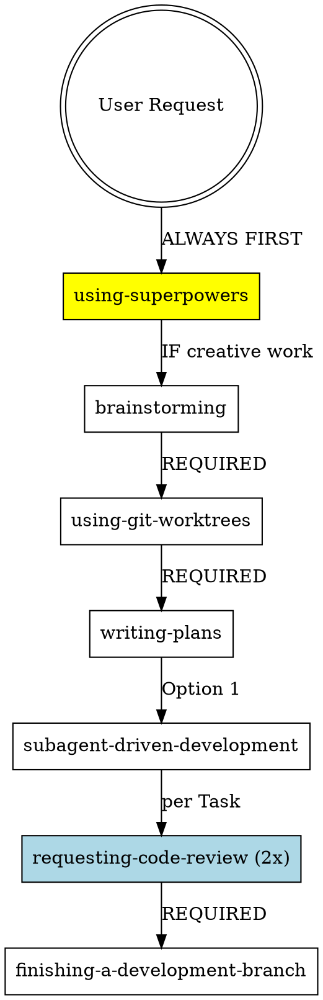

# Superpowers — Framework-Analyse

## Kern-Idee (1 Satz)

Ein vollständiger Software-Development-Workflow für Coding-Agents, der durch streng disciplinierte Skills (Brainstorming → TDD → Subagent-Driven Development → Code Review) sicherstellt, dass Agents niemals direkt Code schreiben, sondern zuerst Design validieren, dann atomic Tasks planen und mit frischen Subagents + zweistufigem Review (Spec → Quality) iterieren.

## Architektur (Dateistruktur, wie funktioniert es technisch?)

### Dateistruktur
```
claude-superpowers/
├── README.md                    # Übersicht, Installation, Workflow
├── skills/                      # Kernstück: 14 Skills
│   ├── brainstorming/
│   ├── test-driven-development/
│   ├── subagent-driven-development/
│   ├── systematic-debugging/
│   ├── verification-before-completion/
│   ├── executing-plans/
│   ├── writing-plans/
│   ├── dispatching-parallel-agents/
│   ├── requesting-code-review/
│   ├── receiving-code-review/
│   ├── using-git-worktrees/
│   ├── finishing-a-development-branch/
│   ├── using-superpowers/
│   └── writing-skills/
├── agents/
│   └── code-reviewer.md         # Spec für Code-Review-Agent
└── commands/                    # CLI-Wrapper für Skills
    ├── brainstorm.md
    ├── write-plan.md
    └── execute-plan.md
```

### Technische Funktionsweise

**1. Skill-System:**
- YAML Frontmatter (name, description) für Discovery
- Markdown-Body mit strengen Strukturvorgaben
- Claude Code lädt Skills via `Skill` Tool on-demand
- `description` muss triggering conditions enthalten, KEINE Workflow-Beschreibung (CSO!)

**2. Automatische Skill-Aktivierung:**
- Agent prüft bei JEDER Anfrage: "Könnte ein Skill passen?" (≥1% Wahrscheinlichkeit = invoke)
- `using-superpowers` MUSS vor jeder Antwort gecheckt werden (HARD-GATE)
- Skills referenzieren sich gegenseitig (z.B. `brainstorming` → `writing-plans` → `subagent-driven-development`)

**3. Mandatory Workflow Chain:**


**4. Subagent Pattern:**
- **Implementer:** Bekommt Task-Text + Kontext, kann Fragen stellen, implementiert mit TDD, self-review
- **Spec Reviewer:** Prüft gegen Plan (nichts fehlt, nichts extra)
- **Code Quality Reviewer:** Prüft Code-Qualität (nach Spec-Approval!)
- Review-Loops: Issues → Implementer fixt → erneutes Review

**5. TDD als Meta-Prinzip:**
- Gilt nicht nur für Code, sondern auch für Skills selbst!
- `writing-skills` Skill verlangt RED-GREEN-REFACTOR für Skill-Erstellung
- Baseline-Test → Skill schreiben → Loopholes pluggen → re-testen

## Einzigartige Stärken (was hat NUR Superpowers?)

### 1. **HARD-GATES als architektonisches Prinzip**
```markdown
<HARD-GATE>
Do NOT invoke any implementation skill, write any code, scaffold any project, 
or take any implementation action until you have presented a design and 
the user has approved it.
</HARD-GATE>
```
Keine Empfehlung, sondern **Blocker**. Agent KANN NICHT weitermachen ohne Compliance.

### 2. **Zwei-stufiges Review (Spec → Quality)**
- Stage 1: Spec-Compliance (nichts fehlt, nichts extra)
- Stage 2: Code Quality (erst nachdem Spec grün ist!)
- Verhindert, dass gut geschriebener Code shipped wird, der das Falsche tut

### 3. **TDD als universelle Meta-Methodology**
- TDD nicht nur für Code, sondern für ALLES (Debugging, Skill-Erstellung, Bugfixes)
- `writing-skills`: Skill-Testing mit Subagents unter Pressure-Scenarios
- Konsistente Philosophy: "Evidence before claims"

### 4. **Rationalization Tables**
Systematische Sammlung von Ausreden + Counters:
```markdown
| Excuse | Reality |
|--------|---------|
| "Too simple to test" | Simple code breaks. Test takes 30 seconds. |
| "I'll test after" | Tests passing immediately prove nothing. |
```
Psychologie-informiertes Design (Cialdini-Prinzipien in `persuasion-principles.md`)

### 5. **Claude Search Optimization (CSO)**
- `description` darf KEINE Workflow-Details enthalten (sonst liest Claude Skill-Body nicht!)
- Keywords für Error-Messages, Symptoms, Tools
- Token-Efficiency-Targets (<150 words für frequently-loaded skills)

### 6. **The Iron Law Pattern**
Jeder strenge Skill hat:
```markdown
## The Iron Law

NO PRODUCTION CODE WITHOUT A FAILING TEST FIRST

Write code before the test? Delete it. Start over.

**No exceptions:**
- Don't keep it as "reference"
- Don't "adapt" it while writing tests
- Delete means delete
```
Null Verhandlungsspielraum, explizite Loophole-Closures.

### 7. **Git Worktrees als Default**
- Parallel Development ohne Branch-Switching
- Systematische Directory-Selection (Prio: existing → CLAUDE.md → ask)
- Safety: `.worktrees` MUSS in .gitignore sein (sonst: add + commit)

### 8. **Pressure-Testing für Skills**
`testing-skills-with-subagents.md` (nicht gelesen, aber referenziert):
- Subagents unter kombinierte Pressures (time + sunk cost + authority + exhaustion)
- Rationalizations dokumentieren → Skill updaten → re-testen
- Skill-Qualität wird empirisch validiert

## Schwächen/Limitierungen (EHRLICH!)

### 1. **Massive Token-Overhead**
- JEDER Task dispatch = 3 Subagents (Implementer + Spec Reviewer + Code Quality Reviewer)
- Review-Loops multiplizieren das
- CSO versucht das zu mildern, aber: frequently-loaded skills = JEDE Session
- **Kostenfaktor:** Bei Claude Opus 4 mit ~$15/MTok input kostet ein einziger Task-Cycle (3 Subagents × 20k context) ~$0.90. Bei 10 Tasks = $9 nur für Reviews.

### 2. **Skill Discovery fragil**
- Abhängig von `description` Qualität
- Agent muss "≥1% Wahrscheinlichkeit" korrekt einschätzen (subjektiv!)
- Keine technische Enforcement von HARD-GATES (nur prompt-based)
- **Was wenn Agent den Check skippt?** → Workflow bricht zusammen

### 3. **Keine Mutation Guards**
- Git Worktrees + Subagents können parallel laufen → Race Conditions
- `dispatching-parallel-agents` sagt "Don't use when shared state", aber keine technische Prevention
- Worktree-Cleanup kann fehlschlagen (ENOTEMPTY), kein Rollback-Mechanismus

### 4. **Human-in-the-Loop Bottleneck**
- Brainstorming → Design Approval → Plan Approval → Implementation
- Bei 3 Approval-Gates vor dem ersten Code = viel Latency
- `subagent-driven-development` reduziert das (autonome Task-Ausführung), aber Design muss vorher stehen

### 5. **TDD Dogma ohne Escape Hatch**
```markdown
Thinking "skip TDD just this once"? Stop. That's rationalization.
```
- Keine Exceptions selbst für: Throwaway Prototypes, Config Files, Generated Code
- "Ask your human partner" = einziger Escape, aber nicht technisch erzwungen
- Kann bei explorativer Arbeit hinderlich sein

### 6. **Keine Project-Memory**
- Skills sind stateless
- Keine Integration mit Knowledge Graphs (Graphiti, Entity-Stores)
- Jede Session startet von vorne (außer Git History)
- **Contrast zu autonomous-stan:** Wir haben `group_id:"main"` + Graphiti als Langzeitgedächtnis

### 7. **Code-Reviewer ist ein Prompt, kein Tool**
- `agents/code-reviewer.md` ist nur ein Model Instruction
- Kein strukturiertes Output-Format
- Keine automatische Issue-Tracking (muss manuell gefixt werden)
- **Contrast:** autonomous-stan hat BusinessMap-Integration für Issue-Tracking

### 8. **Platform-Lock-in (Claude Code)**
- Installation via Plugin Marketplace (Claude Code specific)
- Codex/OpenCode = "manual setup" (weniger poliert)
- Skills nutzen Claude-specific Features (Skill Tool, Task Tool)

### 9. **Keine Error Recovery**
- Was wenn Subagent crasht? Stuck bleibt? Wrong tool calls?
- Keine Timeout-Guards, keine Retry-Logic
- `systematic-debugging` sagt "3+ fixes failed = question architecture", aber kein automatisches Fallback

### 10. **Overengineering für kleine Tasks**
- "Every project goes through this process. A todo list, a single-function utility, a config change"
- Selbst 1-line Change → Brainstorming → Worktree → Plan → Subagent → Review
- **Pragmatismus fehlt:** Manchmal IST eine 1-line Fix tatsächlich trivial

## Key Features (Liste mit Beschreibung)

| Feature | Beschreibung |
|---------|-------------|
| **Brainstorming Skill** | Socratic Refinement: Fragt One-at-a-Time Fragen, präsentiert Design in Chunks, fordert Approval nach jedem Abschnitt. HARD-GATE: Kein Code vor Design-Approval. |
| **Test-Driven Development** | RED-GREEN-REFACTOR als Mandatory Workflow. Jeder Test muss korrekt fehlschlagen (verify RED). Code vor Test = DELETE. Anti-Patterns-Reference inkludiert. |
| **Subagent-Driven Development** | Dispatch fresh Subagent pro Task. 2-Stage Review: Spec Compliance → Code Quality. Review-Loops bis approved. Transparenz via TodoWrite. |
| **Systematic Debugging** | 4-Phase Process: Root Cause Investigation → Pattern Analysis → Hypothesis Testing → Implementation. HARD-RULE: Kein Fix ohne Root Cause. 3+ failed fixes = question architecture. |
| **Verification Before Completion** | "Evidence before claims". MUSS Verification Command laufen + Output lesen vor jedem Success-Claim. "Should pass" = Lying. |
| **Executing Plans** | Alternative zu Subagent-Driven: Batch Execution (3 Tasks) mit Human Review Checkpoints. Weniger autonom, mehr Kontrolle. |
| **Writing Plans** | Bite-Sized Tasks (2-5min each). Exact file paths, complete code, verification steps. Assume "skilled junior with no context". |
| **Git Worktrees** | Systematic Directory Selection + Safety Verification (.gitignore check). Auto-detect project setup (npm/cargo/pip). Verify clean baseline tests. |
| **Requesting Code Review** | Dispatch `code-reviewer` Subagent mit BASE_SHA + HEAD_SHA. Issue Severity: Critical/Important/Minor. Fix before proceeding. |
| **Receiving Code Review** | Technical Evaluation vor Implementierung. Push back erlaubt. YAGNI check. Keine performative Agreements ("You're right!"). |
| **Finishing Development Branch** | 4 Options: Merge locally / Create PR / Keep as-is / Discard. Worktree cleanup nur bei Merge/Discard. Tests MUST pass vor Options. |
| **Using Superpowers** | Meta-Skill: Check vor JEDER Antwort ob Skill relevant (≥1% = invoke). Announces "Using X skill to Y". TodoWrite für Checklists. |
| **Writing Skills** | TDD for Documentation. RED: Baseline Test mit Subagent → GREEN: Skill schreiben → REFACTOR: Loopholes pluggen. Pressure Scenarios mit combined pressures. |
| **Dispatching Parallel Agents** | One Agent per independent problem domain. Nur bei: no shared state, independent failures. Concurrent Investigation. |

## Was autonomous-stan davon fehlt

### 1. **HARD-GATES für Workflow-Enforcement**
Wir haben Guidelines in `AGENTS.md` (`!!karte_zuerst`, `!!graphiti_gate`), aber keine technischen Blocker.

### 2. **Zwei-stufiges Review (Spec → Quality)**
Wir nutzen `code-reviewer` Skill rudimentär, aber kein systematisches 2-Stage Review bei jeder Task.

### 3. **Subagent-Driven Development Pattern**
Wir dispatchen Sub-Agents für lange Tasks, aber:
- Keine frischen Subagents pro atomarem Task
- Keine Review-Loops zwischen Tasks
- Kein strukturiertes Implementer → Spec Reviewer → Quality Reviewer Pattern

### 4. **Git Worktrees als Standard**
Wir arbeiten meist auf main/feature branches, kein systematischer Worktree-Workflow für Isolation.

### 5. **TDD-Enforcement**
Wir haben `tdd-workflow` Skill, aber kein "DELETE code if written before test" Iron Law.

### 6. **Systematic Debugging mit 4-Phase Process**
Unsere `stanflux` Skill ist fuzzy ("stuck"), Superpowers' `systematic-debugging` ist strukturierter:
- Phase 1: Root Cause (MUST complete before fixes)
- Phase 2: Pattern Analysis
- Phase 3: Hypothesis Testing
- Phase 4: Implementation
- "3+ fixes failed = question architecture" Rule

### 7. **Verification Before Completion**
Wir haben `!!antwort_disziplin:konsolidierung`, aber kein "run verification command + read output" Gate vor Success Claims.

### 8. **Claude Search Optimization (CSO)**
Unsere Skills haben keine CSO-optimierten `description` fields (keine YAML Frontmatter).

### 9. **Rationalization Tables in Skills**
Unsere Skills haben "Regeln", aber keine systematische Liste von Excuses + Counters.

### 10. **Skill-Testing Methodology**
Wir haben keine Pressure-Testing für Skills (Subagents unter combined pressures).

## Was autonomous-stan schon hat

### 1. **Graphiti Integration (Langzeitgedächtnis)**
Superpowers hat KEINE Persistenz zwischen Sessions. Wir haben `group_id:"main"` + Graphiti für Learnings/Decisions.

### 2. **BusinessMap Integration (Issue Tracking)**
Superpowers' Code-Reviews sind Ad-Hoc. Wir tracken Issues in BusinessMap Board 5 mit Workflows.

### 3. **Multi-Channel Communication**
Superpowers ist CLI-only. Wir haben Discord, WhatsApp, Email-Pipeline (n8n).

### 4. **Agent-to-Agent Communication**
`sessions_send` mit fire-and-forget. Superpowers hat Subagents, aber keine inter-Agent Messaging.

### 5. **Kalender/Scheduling (Morgen)**
Superpowers hat keine Time-Awareness. Wir haben `morgen.morgen_list_events` für Terminkonflikte.

### 6. **Infrastruktur-Awareness**
`!!github_infra` Rule: Issue in marakanda-infrastructure statt direkt fummeln. Superpowers kennt kein Infra-Management.

### 7. **Heartbeat System**
Periodische Checks (08:00-22:00 Vienna). Superpowers hat keine Cron-ähnliche Funktionalität.

### 8. **PITH Notation**
Kompakte Syntax für Rules (`!!agent_comm`, `!!browser`). Superpowers nutzt plain Markdown.

### 9. **Mermaid Diagrams Skill**
Wir haben dedizierte Mermaid Skill (vs. ASCII). Superpowers nutzt Graphviz Dot.

### 10. **Context7 for Live Docs**
Web-Dev Skill holt live Docs. Superpowers hat keine dynamische Doc-Integration.

### 11. **Firecrawl für Web Scraping**
Strukturiertes Crawling/Extraction. Superpowers hat kein equivalent.

### 12. **1Password Integration**
Credentials aus 1Password. Superpowers hat keine Secret-Management-Integration.

### 13. **Morgen für Captcha Solving**
CapSolver API. Superpowers hat keine Captcha-Handling.

### 14. **Project Context System**
`AGENTS.md`, `SOUL.md`, `USER.md`, `TOOLS.md`, `HEARTBEAT.md`. Superpowers hat nur CLAUDE.md (optional).

### 15. **Memory Maintenance Workflow**
`memory/YYYY-MM-DD.md` → `MEMORY.md` destillieren. Superpowers hat keine Memory-Strategie.

## Vergleich mit OpenClaw Skills-System

| Dimension | Superpowers | OpenClaw (autonomous-stan) |
|-----------|-------------|----------------------------|
| **Discovery** | YAML Frontmatter (name, description) | File-based, geladen via Project Context |
| **Loading** | On-demand via `Skill` Tool | Pre-loaded (alle Skills in Context) |
| **Enforcement** | HARD-GATES (prompt-based) | PITH Rules (prompt-based) |
| **Structure** | Strict (Overview → When → Process → Checklist) | Flexible (PITH für kompakte Syntax) |
| **Token Optimization** | CSO: <150 words für frequent skills | Keine expliziten Limits |
| **Testing** | Pressure-Testing mit Subagents | Keine Skill-Testing Methodology |
| **Cross-References** | Skill name only, REQUIRED SUB-SKILL markers | @ syntax force-loads files |
| **Flowcharts** | Graphviz Dot (only for non-obvious decisions) | Mermaid (IMMER statt ASCII) |
| **Anti-Patterns** | Explicit (Testing Anti-Patterns, Common Mistakes) | Implicit (Rules in AGENTS.md) |
| **Rationalization Tables** | Ja (Excuse → Reality) | Nein |
| **Meta-Skills** | `using-superpowers` (check vor jeder Antwort) | Keine Meta-Skill für Skill-Discovery |
| **Subagent Pattern** | Structured (Implementer → Spec Reviewer → Quality Reviewer) | Ad-Hoc (fire-and-forget) |
| **Persistence** | Keine (Git only) | Graphiti + Markdown Memory |
| **Context Awareness** | Project-only (Worktrees, Git) | Multi-Source (Calendar, Discord, BusinessMap, Graphiti) |
| **Workflow Chains** | Mandatory (Brainstorming → Planning → Implementation) | Optional (Guidelines, nicht enforced) |

### Technische Unterschiede

**Superpowers:**
- Skills sind **Workflow-Definitions** (MUSS befolgt werden)
- HARD-GATES blockieren Progress bis Compliance
- Subagents sind **fresh per Task** (no context pollution)
- TDD als universelle Methodology (Code + Skills + Debugging)

**autonomous-stan:**
- Skills sind **Tools/Helpers** (können genutzt werden)
- PITH Rules sind Guidelines (kein technischer Block)
- Sub-Agents sind **fire-and-forget** (sessions_send timeout=0)
- TDD ist ein Workflow, aber nicht universell enforced

### Philosophische Unterschiede

**Superpowers:**
- **Discipline über Flexibility:** "Violating the letter = violating the spirit"
- **Evidence over Claims:** "Should work" = Lying
- **Process über Ad-Hoc:** Selbst triviale Tasks durchlaufen full Workflow

**autonomous-stan:**
- **Pragmatismus über Dogma:** "Wenn sinnvoll, dann Guidelines"
- **Ergebnisse über Prozess:** `!!antwort_disziplin:konsolidierung` (EINE Nachricht)
- **Adaptive Workflows:** Heartbeat vs. Immediate Response

## Konkrete Übernahme-Empfehlungen (was + wie + Priorität HIGH/MED/LOW)

### HIGH Priority (sofort übernehmbar, großer Impact)

#### 1. **HARD-GATES für kritische Workflows**
**Was:** `!!graphiti_gate` und `!!karte_zuerst` als technische Blocker (nicht nur Guidelines).
**Wie:**
```markdown
<HARD-GATE>
!!graphiti_gate:VOR jeder Aktion bei→Neuer Lead|Tech-Problem|Projekt-Start
  |ERST:`mcporter call 'graphiti.search_nodes(...)'`
  |DANN:Ergebnis lesen+einbeziehen
  |DANN_ERST:Arbeiten
</HARD-GATE>
```
**Warum:** Verhindert, dass Stan ohne Context arbeitet (häufiges Problem).
**Implementation:** `AGENTS.md` Update, Test mit Subagent unter Time-Pressure.

#### 2. **Zwei-stufiges Review (Spec → Quality)**
**Was:** Bei jedem Task erst Spec-Compliance prüfen, dann Code-Quality.
**Wie:**
```markdown
!!code_review:Zwei Stages — NICHT kombiniert
  |stage_1:Spec Reviewer (nichts fehlt, nichts extra)
  |stage_2:Code Quality Reviewer (NUR wenn Stage 1 ✅)
  |warum:Gut geschriebener Code der Falsches tut = nutzlos
```
**Warum:** Unsere bisherigen Code-Reviews prüfen beides gleichzeitig → Spec-Gaps werden übersehen.
**Implementation:** Neuer Skill `skills/two-stage-review/SKILL.md`, Integration in `multi-agent` Skill.

#### 3. **Verification Before Completion Gate**
**Was:** Kein Success-Claim ohne `run command + read output`.
**Wie:**
```markdown
!!verification:ABSOLUTES GESETZ
  |vor_claim:MUSS Command laufen + Output gelesen
  |"should_work":VERBOTEN|"looks_correct":VERBOTEN|"seems_fine":VERBOTEN
  |nur_erlaubt:"[RAN npm test] [SAW: 47/47 pass] All tests pass"
  |anti:Vertrauen auf cached Output, Annahmen, "confidence"
```
**Warum:** Wir haben mehrfach "Done!" gesagt ohne zu verifizieren → Bugs in Production.
**Implementation:** `AGENTS.md` Update, Integration in `antwort_disziplin`.

#### 4. **Rationalization Tables in kritischen Skills**
**Was:** Systematische Excuse → Reality Tables.
**Wie:** In `skills/tdd-workflow/SKILL.md`, `skills/stanflux/SKILL.md`:
```markdown
| Excuse | Reality |
|--------|---------|
| "Zu simpel für Test" | Simple Code bricht auch. Test dauert 30 Sekunden. |
| "Teste später" | Tests die sofort passen beweisen nichts. |
```
**Warum:** Macht Rationalizations explizit → schwerer zu ignorieren.
**Implementation:** Bestehende Skills updaten + neue Abschnitte.

#### 5. **Git Worktrees für Feature Development**
**Was:** Default Workflow für Features: Worktree statt Branch-Switching.
**Wie:**
- Neuer Skill `skills/git-worktrees/SKILL.md` (adaptiert von Superpowers)
- Integration in Feature-Workflow: Graphiti Check → Karte → Worktree → Implement
- Safety Verification: `.worktrees` in `.gitignore` check
**Warum:** Parallel Features ohne Context-Switching, saubere Isolation.
**Implementation:** 1-2 Stunden, Test mit nächstem Feature.

### MED Priority (hilfreich, mittlerer Aufwand)

#### 6. **Systematic Debugging 4-Phase Process**
**Was:** `stanflux` Skill durch strukturiertes 4-Phase Protocol ersetzen.
**Wie:**
```markdown
# Phase 1: Root Cause Investigation (MUST complete first)
# Phase 2: Pattern Analysis
# Phase 3: Hypothesis Testing
# Phase 4: Implementation
# Rule: 3+ failed fixes = question architecture
```
**Warum:** `stanflux` ist fuzzy ("stuck, raten, Fehler-Loops"), Superpowers' Debugging ist systematischer.
**Implementation:** `skills/stanflux/SKILL.md` refactoren, Supporting Files: `root-cause-tracing.md`, `defense-in-depth.md`.

#### 7. **Claude Search Optimization (CSO) für Skills**
**Was:** YAML Frontmatter + CSO-optimierte Descriptions.
**Wie:**
- Alle Skills: Add YAML Header (name, description)
- Description: "Use when [triggers]" — KEINE Workflow-Details!
- Keywords für Error-Messages, Symptoms, Tools
**Warum:** Bessere Skill-Discovery (aktuell: Skills sind pre-loaded, aber bei wachsender Zahl könnte on-demand Loading sinnvoll sein).
**Implementation:** Skill-Template updaten, bestehende Skills migrieren (30min pro Skill).

#### 8. **TDD Iron Law**
**Was:** "Code vor Test = DELETE" als absolute Rule.
**Wie:**
```markdown
## The Iron Law

NO PRODUCTION CODE WITHOUT A FAILING TEST FIRST

Write code before the test? Delete it. Start over.

**No exceptions:**
- Don't keep it as "reference"
- Don't "adapt" it while writing tests
- Delete means delete
```
**Warum:** TDD-Workflow Skill ist aktuell "empfohlen", nicht "mandatory".
**Implementation:** `skills/tdd-workflow/SKILL.md` Update, Enforcement via Pressure-Testing.

#### 9. **Brainstorming Skill mit HARD-GATE**
**Was:** Vor jeder Feature-Implementierung: Socratic Refinement + Design Approval.
**Wie:**
- Neuer Skill `skills/brainstorming/SKILL.md`
- HARD-GATE: No code before design approval
- Integration: `!!karte_zuerst` → Brainstorming → Plan → Implement
**Warum:** Wir jumpen oft direkt in Implementation ohne Design-Validation.
**Implementation:** 2-3 Stunden, Test mit nächster Feature-Anfrage.

#### 10. **Subagent-Driven Development Pattern**
**Was:** Fresh Subagent pro atomarem Task + Review-Loops.
**Wie:**
- Neuer Skill `skills/subagent-driven-development/SKILL.md`
- Integration mit `multi-agent` Skill
- TodoWrite für Task-Tracking
**Warum:** Unsere Sub-Agents sind fire-and-forget, keine Review-Loops.
**Implementation:** 3-4 Stunden, Test mit Multi-Task Feature.

### LOW Priority (nice to have, hoher Aufwand oder geringer Impact)

#### 11. **Writing Skills Skill mit TDD für Documentation**
**Was:** Skill-Creation als TDD-Process (RED-GREEN-REFACTOR).
**Wie:**
- `skills/skill-builder/SKILL.md` erweitern
- Pressure-Testing Methodology: Subagents unter combined pressures
- Baseline → Skill → Plug Loopholes → Re-Test
**Warum:** Skill-Qualität würde steigen, aber: Skills sind aktuell stable, nicht viele neue Skills.
**Implementation:** 4-5 Stunden, erst bei nächstem Skill-Refactor relevant.

#### 12. **Dispatching Parallel Agents Skill**
**Was:** One Agent per independent problem domain.
**Wie:**
- Neuer Skill `skills/parallel-agents/SKILL.md`
- Nur bei: independent failures, no shared state
- Concurrent Investigation
**Warum:** Wir haben Multi-Agent, aber kein systematisches Parallel-Dispatch Pattern.
**Implementation:** 2 Stunden, Test bei Multi-Subsystem Bug.

#### 13. **Finishing Development Branch Skill**
**Was:** 4 Options: Merge locally / Create PR / Keep / Discard.
**Wie:**
- Neuer Skill `skills/finishing-branch/SKILL.md`
- Integration mit Git Worktrees Skill
- Worktree cleanup nur bei Merge/Discard
**Warum:** Unsere Feature-Branches haben keinen strukturierten Completion-Workflow.
**Implementation:** 1-2 Stunden, Test nach Worktree-Adoption.

#### 14. **Code-Reviewer als strukturiertes Tool**
**Was:** Code-Reviewer mit strukturiertem Output (Critical/Important/Minor).
**Wie:**
- `agents/code-reviewer.md` erweitern
- Output-Schema: Strengths | Issues (Severity) | Assessment
- Integration mit BusinessMap (Issue-Tracking)
**Warum:** Superpowers' Code-Reviewer ist nur Prompt, wir könnten strukturierter sein.
**Implementation:** 3 Stunden, Test nach Two-Stage Review Implementation.

#### 15. **Receiving Code Review Skill**
**Was:** Technical Evaluation vor Implementierung, Push-back erlaubt.
**Wie:**
- Neuer Skill `skills/receiving-review/SKILL.md`
- YAGNI check, Technical Correctness Verification
- "No performative agreements" Rule
**Warum:** Wir haben keine Guidelines für Review-Response.
**Implementation:** 1 Stunde, erst bei regelmäßigen External Reviews relevant.

---

## Fazit

**Superpowers ist ein beeindruckend durchdachtes System** für disciplinierte Software-Development. Die Stärken:

### Was Superpowers richtig macht:
1. **Workflow-Enforcement durch HARD-GATES** (nicht nur Empfehlungen)
2. **TDD als universelle Methodology** (Code + Skills + Debugging)
3. **Zwei-stufiges Review** verhindert "gut geschriebener Code der das Falsche tut"
4. **Rationalization-Aware Design** (Psychologie-informiert, Excuse-Tables)
5. **Evidence-First Kultur** ("Should work" = Lying)

### Was autonomous-stan besser macht:
1. **Langzeitgedächtnis** (Graphiti vs. none)
2. **Multi-Channel Integration** (Discord, Email, Calendar vs. CLI-only)
3. **Pragmatismus** (Guidelines vs. Dogma)
4. **Context-Awareness** (BusinessMap, 1Password, n8n vs. Git-only)
5. **Adaptive Workflows** (Heartbeat, fire-and-forget Subagents vs. synchronous only)

### Hybridstrategie (empfohlen):
- **Von Superpowers übernehmen:** HARD-GATES, Two-Stage Review, Verification Before Completion, Rationalization Tables, Git Worktrees
- **Von autonomous-stan behalten:** Graphiti, Multi-Channel, Pragmatismus, Infrastruktur-Awareness, PITH Notation
- **Nicht übernehmen:** TDD-Dogma ohne Escape (zu rigid), Mandatory Brainstorming für triviale Tasks, Subagent-Overhead bei allen Tasks

### Konkrete Next Steps:
1. **Sofort:** HARD-GATE für `!!graphiti_gate` + Two-Stage Review implementieren (HIGH Priority #1-2)
2. **Diese Woche:** Verification Before Completion + Rationalization Tables (HIGH Priority #3-4)
3. **Nächster Sprint:** Git Worktrees + Systematic Debugging 4-Phase (HIGH Priority #5, MED Priority #6)

**Bottom Line:** Superpowers ist exzellent für Code-Quality-Enforcement, aber zu rigid und ohne Context-Awareness. Autonomous-stan ist pragmatischer und context-aware, aber zu locker bei Quality-Gates. Die richtige Balance: **Superpowers' Discipline + autonomous-stan's Context = Best of Both Worlds.**